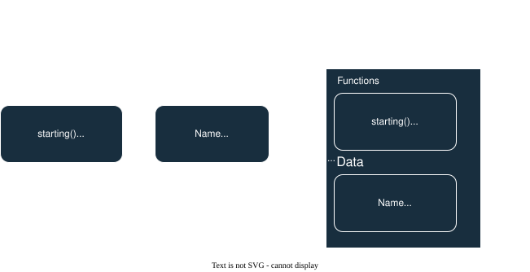

## 2. Object-Oriented Programming (OOP)

Organize code around objects that contain both data and methods.

### Why Can't We Use name Directly?

```py
class Course:
    def __init__(self, name, duration):
         # Object's attribute (stored in the object)
        self.name = name
        self.duration = duration
    # Parameter (temporary variable)
    def start_course(self, name):
        print(f"Starting, {name}")
        # Object's stored name
        print(f"Course name: {self.name}")
```

```py
course = Course("Python Basics", "8 weeks")
course.start_course("Advanced Python")
```

#### Output:

```ssh
Starting, Advanced Python          ← Uses parameter 'name'
Course name: Python Basics         ← Uses self.name (object's stored data)
```

### Why Do We Need `self` All The Time?

self represents the specific object that is calling the method. Without it, Python doesn't know which object's data to use.

```py
class Course:
    def __init__(self, name, duration):
        self.name = name
        self.duration = duration

    # No self!
    def show_info():
         # Which 'name'? Python doesn't know!
        print(f"Course: {name}")
```

#### What happens:

```py
pythoncourse = Course("Python", "8 weeks")
course.show_info() # ERROR: show_info() takes 0 arguments but 1 was given
```

## Behind The Scenes

When we call `course1.show_info()`, Python automatically does:

```py
# Passes the object as the first argument!
Course.show_info(course1)
```

That's why the first parameter must be self - to receive the object.

**Procedural** = Having ingredients (data) in one place and recipes (functions) in another. You have to fetch ingredients and bring them to the recipe book every time.
**OOP** = A complete kitchen appliance (like a coffee maker) that has both the ingredients (water, coffee) AND the functions (brew, heat, pour) built-in. Everything works together as one unit.

<p align="center">
  
</p>
