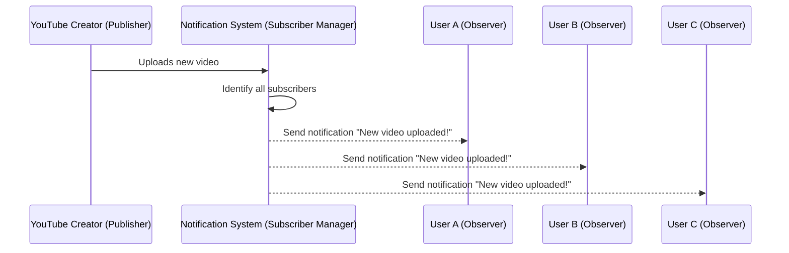

## What is Observer Pattern?

The Observer Pattern defines a one-to-many dependency between objects so that when one object (the Subject) changes state, all its dependents (the Observers) are notified and updated automatically.

The Observer Pattern is a Behavioral Design Pattern that focuses on decoupled communication and state change management.

In simple terms:
Objects subscribe to events and get notified when events happen.

`Analogy`: YouTube subscriptions - when a channel posts a video, all subscribers get notified.

What: When X happens, notify Y (event-driven)

Publish/subscribe; subjects notify observers on events.

## Where in Django:

- Notifications, logging, analytics
- Signals (post_save, pre_delete, request_finished)

### Pros:

- decouples emitters from listeners.
- easy side-effects (emails, logs).

## Cons:

- hidden control flow
- overuse makes behavior hard to track.

It means the emitter just announces an event; it doesn’t know who will react or how. Listeners subscribe independently, so you can add/remove/modify them without touching the source—making code easier to change, test, and reuse.

### Implementation in Django (Signals)

Django implements the Observer Pattern using its built-in Signals Dispatcher.

### Syntax

```py
@receiver(signal_type, sender=Model)
def function_name(sender, instance, created, **kwargs):
    #               ↑      ↑        ↑       ↑
    #               |      |        |       └─ Extra (rarely used)
    #               |      |        └─ Created=True, Updated=False
    #               |      └─ The object (user, course, etc.)
    #               └─ The model class (User, Course, etc.)
    pass
```

```py
from django.db.models.signals import post_save
from django.dispatch import receiver
from django.core.mail import send_mail

@receiver(post_save, sender=User)
def send_welcome_email(sender, instance, created, **kwargs):
    if created:  # Only for new users, not updates
        send_mail(
            subject='Welcome!',
            message=f'Hello {instance.username}, welcome to our site!',
            from_email='noreply@example.com',
            recipient_list=[instance.email]
        )
```

#### When someone registers:

```py
User.objects.create(username='ahmad', email='ahmad@example.com')
# → Automatically sends welcome email to ahmad@example.com
```

# Django Signals

## Model Signals

| Signal         | When It Fires                                |
| -------------- | -------------------------------------------- |
| pre_init       | Before a model’s `__init__` runs             |
| post_init      | After a model’s `__init__` runs              |
| pre_save       | Before saving to the database                |
| post_save      | After saving to the database                 |
| pre_delete     | Before deleting from the database            |
| post_delete    | After deleting from the database             |
| m2m_changed    | When a Many-To-Many field changes            |
| class_prepared | When Django finishes preparing a model class |

## Authentication Signals

| Signal            | When It Fires       |
| ----------------- | ------------------- |
| user_logged_in    | After user logs in  |
| user_logged_out   | After user logs out |
| user_login_failed | When login fails    |

## Request/Response Signals

| Signal                | When It Fires                             |
| --------------------- | ----------------------------------------- |
| request_started       | At the beginning of a request             |
| request_finished      | At the end of a request                   |
| got_request_exception | When an exception occurs during a request |

## Database Signals

| Signal             | When It Fires                   |
| ------------------ | ------------------------------- |
| connection_created | When a DB connection is created |

## Migration Signals

| Signal       | When It Fires         |
| ------------ | --------------------- |
| pre_migrate  | Before migrations run |
| post_migrate | After migrations run  |



Resources:

- [refactor-guru](https://refactoring.guru/design-patterns/observer)
